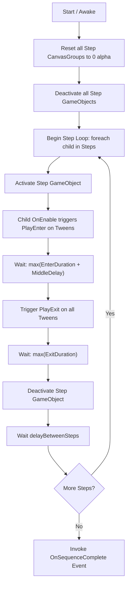

# SplashScreenSystem Implementation Guide

This guide details the architecture, component reference, setup instructions, and customization patterns for **SplashScreenSystem**.

---

## 1. System Architecture & Lifecycle

`SplashScreenSystem` coordinates multi-step splash screens sequentially using asynchronous tasks powered by `UniTask`. It decouples step choreography from specific animation effects by using an abstract tween base class (`SplashScreenTween`).

### Execution Flow Diagram



---

## 2. Component Reference

### 2.1 `SplashScreenSequencer`

Coordinates step activation, synchronization, and triggers the completion callback.

- **Namespace**: `SplashScreenSystem`
- **Inherits**: `MonoBehaviour`

| Property | Type | Description |
| :--- | :--- | :--- |
| `steps` | `List<GameObject>` | Explicit list of step GameObjects played in sequence order. |
| `delayBetweenSteps` | `float` | Delay (in seconds) to wait after a step's exit tweens complete before activating the next step. Default: `0.5f`. |
| `onSequenceComplete` | `UnityEvent` | Invoked when all steps in the sequence have completed. |

#### Key Lifecycle Details:
- **Awake**: All `CanvasGroup` components on configured steps are initialized to `alpha = 0f` to avoid single-frame flickering before tweens kick in, and step GameObjects are deactivated.
- **Start**: Automatically begins sequence execution asynchronously (`PlaySequenceAsync`).
- **OnDestroy**: Automatically cancels the internal `CancellationTokenSource` so that running async delays terminate cleanly if the scene or GameObject is destroyed early.

---

### 2.2 `SplashScreenTween` (Abstract Base)

Abstract foundation for all splash animations.

- **Namespace**: `SplashScreenSystem`
- **Inherits**: `MonoBehaviour`

| Property / Method | Type | Description |
| :--- | :--- | :--- |
| `MiddleDelay` | `float` | Delay in seconds between the enter transition completing and the exit transition beginning (hold time). |
| `EnterDuration` | `float` (abstract) | Total duration of the enter animation in seconds. |
| `ExitDuration` | `float` (abstract) | Total duration of the exit animation in seconds. |
| `PlayEnter()` | `void` (abstract) | Executes the enter animation. Called automatically in `OnEnable()`. |
| `PlayExit()` | `void` (abstract) | Executes the exit animation. Called by `SplashScreenSequencer`. |

---

### 2.3 `SplashScreenFadeTween`

Fades a `CanvasGroup` alpha in and out using DOTween.

- **Namespace**: `SplashScreenSystem`
- **Inherits**: `SplashScreenTween`
- **Requirement**: `[RequireComponent(typeof(CanvasGroup))]`

| Property | Type | Default | Description |
| :--- | :--- | :--- | :--- |
| `canvasGroup` | `CanvasGroup` | Self | Target `CanvasGroup`. Automatically resolved on `Awake()` if null. |
| `enterDuration` | `float` | `0.5f` | Duration of the fade-in transition. |
| `exitDuration` | `float` | `0.5f` | Duration of the fade-out transition. |
| `enterEase` | `Ease` | `Ease.OutQuad` | Easing curve applied to fade-in. |
| `exitEase` | `Ease` | `Ease.OutQuad` | Easing curve applied to fade-out. |
| `startAlpha` | `float` | `0f` | Alpha at which the enter transition starts. |
| `endAlpha` | `float` | `1f` | Target alpha after enter transition (and starting alpha for exit). |
| `exitEndAlpha` | `float` | `0f` | Target alpha after exit transition. |

---

### 2.4 `SplashScreenScaleTween`

Scales a `RectTransform` in and out using DOTween.

- **Namespace**: `SplashScreenSystem`
- **Inherits**: `SplashScreenTween`
- **Requirement**: `[RequireComponent(typeof(RectTransform))]`

| Property | Type | Default | Description |
| :--- | :--- | :--- | :--- |
| `rectTransform` | `RectTransform` | Self | Target `RectTransform`. Automatically resolved on `Awake()` if null. |
| `enterDuration` | `float` | `0.5f` | Duration of the scale-in transition. |
| `exitDuration` | `float` | `0.5f` | Duration of the scale-out transition. |
| `enterEase` | `Ease` | `Ease.OutBack` | Easing curve applied to scale-in. |
| `exitEase` | `Ease` | `Ease.InBack` | Easing curve applied to scale-out. |
| `startScale` | `Vector3` | `Vector3.zero` | Initial scale before enter transition. |
| `endScale` | `Vector3` | `Vector3.one` | Target scale after enter transition. |
| `exitEndScale` | `Vector3` | `Vector3.zero` | Final scale after exit transition. |

---

## 3. Step-by-Step Setup Guide

### Step 1: Create the UI Hierarchy
1. In your scene, create a UI Canvas (**GameObject > UI > Canvas**).
2. Configure the `CanvasScaler`:
   - **UI Scale Mode**: `Scale With Screen Size`
   - **Reference Resolution**: e.g., `1920 x 1080`
   - **Screen Match Mode**: `Match Width Or Height` (`0.5`)
3. Create a background child GameObject (e.g. `BG`) with an `Image` component stretched across the full screen.

### Step 2: Add the Sequencer
1. On the `Canvas` or a dedicated child container (e.g., `SplashScreen`), add the `SplashScreenSequencer` component.

### Step 3: Create Steps
For each splash item you want to display (e.g., Publisher Logo, Engine Logo, Studio Logo):
1. Create a child GameObject under `SplashScreen` (e.g., `Step_StudioLogo`).
2. Add a `CanvasGroup` component.
3. Add `SplashScreenFadeTween` to handle fading.
4. (Optional) Add `SplashScreenScaleTween` to handle scaling concurrently.
5. Create child `Image` elements displaying your logo or text.
6. Configure the `Middle Delay`, `Enter Duration`, `Exit Duration`, and ease curves in the Inspector.

### Step 4: Configure Sequencer Steps & Completion
1. Drag each step GameObject into the `Steps` list on `SplashScreenSequencer` in your desired playback order.
2. In the `OnSequenceComplete` event, add a callback:
   - Example: Call `SceneManager.LoadScene("MainMenu")` or trigger a game initialization bootstrap method.

---

## 4. Working with the Demo Sample

### Importing the Demo
1. Open **Window > Package Manager**.
2. Select **In Project** > **SplashScreenSystem**.
3. Under **Samples**, click **Import** next to **Demo**.
4. The files will be copied into:
   ```text
   Assets/Samples/SplashScreenSystem/1.0.0/Demo/
   ```

### Demo Assets Overview
- `BootLoaderSplashScreenDemo.unity`: Pre-configured scene with camera, event system, lighting, and a fully functional splash screen canvas.
- `SplashScreen.prefab`: Multi-step splash canvas containing:
  - Background image (`BG`)
  - 4 sequential steps: Publisher, Engine, Studio, and Platform.
- `Logo.prefab`: Modular logo prefab template with `SplashScreenFadeTween` and `SplashScreenScaleTween`.

---

## 5. Creating Custom Tween Components

You can create custom animations (such as position slides or rotations) by deriving from `SplashScreenTween`:

```csharp
using UnityEngine;
using DG.Tweening;
using SplashScreenSystem;

public class SplashScreenSlideTween : SplashScreenTween
{
    [SerializeField] RectTransform rectTransform;
    [SerializeField] Vector2 startOffset = new Vector2(-1000f, 0f);
    [SerializeField] Vector2 endPosition = Vector2.zero;
    [SerializeField] Vector2 exitOffset = new Vector2(1000f, 0f);
    [SerializeField] float enterDuration = 0.6f;
    [SerializeField] float exitDuration = 0.6f;
    [SerializeField] Ease enterEase = Ease.OutCubic;
    [SerializeField] Ease exitEase = Ease.InCubic;

    Tween slideTween;

    public override float EnterDuration => enterDuration;
    public override float ExitDuration => exitDuration;

    void Awake()
    {
        if (rectTransform == null)
            rectTransform = GetComponent<RectTransform>();
    }

    void OnDestroy()
    {
        slideTween?.Kill();
    }

    public override void PlayEnter()
    {
        slideTween?.Kill();
        rectTransform.anchoredPosition = startOffset;
        slideTween = rectTransform.DOAnchorPos(endPosition, enterDuration)
            .SetEase(enterEase)
            .SetUpdate(true);
    }

    public override void PlayExit()
    {
        slideTween?.Kill();
        slideTween = rectTransform.DOAnchorPos(exitOffset, exitDuration)
            .SetEase(exitEase)
            .SetUpdate(true);
    }
}
```

Because `SplashScreenSequencer` automatically detects all `SplashScreenTween` components on child steps, your custom tween will automatically synchronize with the sequence timeline.

---

## 6. Dependency Setup & Troubleshooting

### DOTween Assembly Reference
If you encounter compilation errors stating `The type or namespace name 'DG' could not be found`:
1. Ensure DOTween is imported in your project.
2. Open **Tools > Demigiant > DOTween Utility Panel**.
3. Click **Create ASMDEF** to generate `DOTween.Modules.asmdef`.

### UniTask
If `Cysharp.Threading.Tasks` is missing:
1. Open Package Manager > **Add package from git URL...**
2. Enter:
   ```text
   https://github.com/Cysharp/UniTask.git?path=src/UniTask/Assets/Plugins/UniTask
   ```
